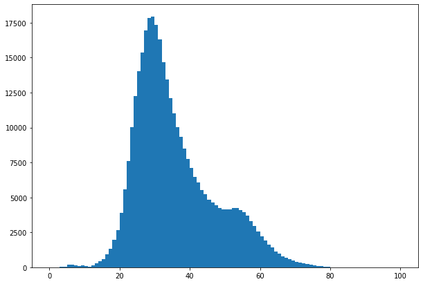
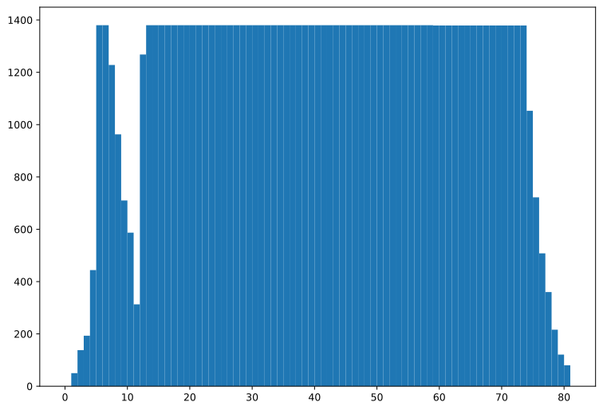
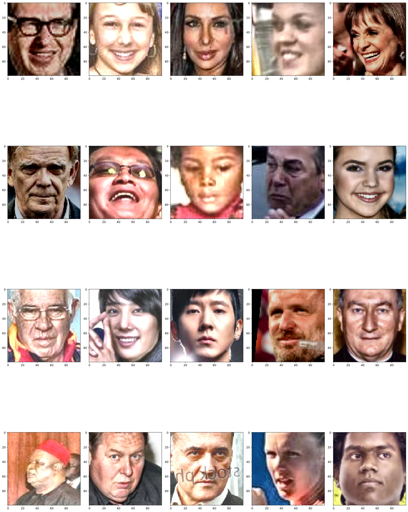
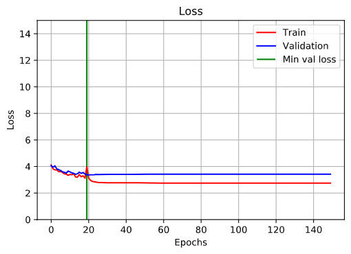
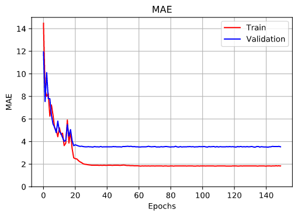
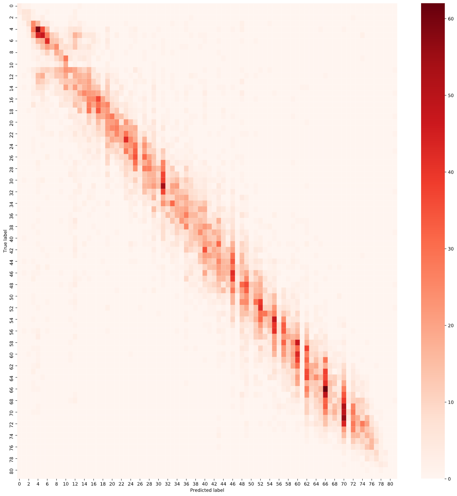

## Age Estimation project

This is a small project in which using deep learning, we train a network that predicts the age of a person based on the
face

## How to run

### Locally using Docker

If you have docker installed locally, you can run the code by executing this steps:

1. ```shell
   git clone https://github.com/paolo-sofia/age-estimation-project.git && cd age-estimation-project
   ```
2. ```shell
   docker compose up
   ```
3. Open your web browser at this [page](http://0.0.0.0:8501/)

### Using streamlit deploy

The project is deployed on streamlit cloud, so you can head directly to
[this page](https://ageestimation.streamlit.app/) and start playing with the web ui.

## Description of the solution

The designed model is based on exact age classification, and therefore on a multi-class classification approach,
however, the dataset used only contains images of people with ages in the range [1.82], so the proposed model was
trained on 82 classes, so by default the model cannot predict people older than 85 years old.

## Resnet

The model chosen for the training of the network is Resnet18.


## Dataset

The dataset used is **VGGface2**, the largest dataset currently present regarding people's faces. The dataset consists
of
about 3100000 faces, although not belonging to 3100000 different people, but belonging to about 9000 different people.
However, the dataset is not completely annotated, in fact there are about 70,000 samples whose label is absent. The
labels are expressed as floating point numbers, but since classification was used, the labels were rounded to the
nearest integer, using python's _round()_ function.

#### Unbalanced dataset

The dataset is not well-balanced, given that out of approximately 3,000,000 images, there are
only 9,000 identities, which therefore have a very limited age range. Analyzing the dataset, it is noted that there
are few children and the elderly, and therefore most of the samples are concentrated in the age range of
approximately 20-50, as can be seen from figure 3 below which shows the histogram with the classes. The average age
in the dataset is 35.35, with a variance of 11.46; this means that this problem must be taken into account in the
training phase, otherwise the network may succeed in learning to estimate only the age of subjects in the
range [20-50].



To solve the class imbalance problem, a preprocessing step was carried out on the dataset, selecting only 95,000
elements in which all classes are present with the same amount of samples more or less



## Face Detection

The dataset also has samples where there are multiple faces, and you need to cut these faces so that you only have the
face of the person of interest. To do this in the preprocessing phase, the image was cropped using face detection. To
carry out the detection, the opencv library was used, which provides algorithms for recognizing faces in an image. The
detector used is the CNN-based face detector, which is very efficient. In some cases the detector failed to identify
faces, in those cases only a resizing of the image was performed. In all other cases the image was cropped to
contain only the face, and in the case of multiple faces detected, the face present in the foreground was selected
through an algorithm. Following this step, all the faces have been aligned, using the shape predictor of the dlib
library. In this way all the faces are aligned in such a way as to have the salient parts (nose, eyes, mouth) in the
same area.

## Face Pre-Processing

Before being sent into the network, the samples have been pre-processed in order to make the training of the network
less complicated. The preprocessing operations performed were:

- *image resize*. The dataset does not have a fixed image size, but varies. However, most of the images are of low
  quality
  and very small, around 100 pixels. Going to crop the images with face detection, the images become even smaller;
  consequently, if you up-sample your samples by increasing the image size, you risk losing important features due to
  image enlargement. Also, enlarging very small images can lead to the introduction of unwanted noise. For this reason
  it was decided to resize the 100x100 images. The images have been kept in RGB, and not converted to grayscale, as
  features such as hair color can be crucial for correct age estimation.
- Many images have non-ideal lighting, such as too dark or too bright. The *CLAHE* performs a local equalization of the
  histogram, in order to make the image better in regard to the lighting. The image is divided into a grid and the
  isogram equalization operation is performed in each cell. Each image has been split into 9 cells, (3x3), with a clip
  value of 2.
- Samples have been *normalized* to fall within the range [0,1].

## Data Augmentation

Data augmentation operations used:

- random horizontal flip
- random brightness, addition of random brightness, with max\_delta value = 0.2
- random saturation, with lower bound = 0.75 and upper bound = 1



## **Training**

Training was done in 2 steps:

1. The first step is to train 100 epochs using 85% of the dataset, while the remaining 15% is used for validation. In
   this first training we used the Adam optimizer with a default learning rate equal to 0.001, to speed up the
   convergence towards the minimum. The other hyperparameters of the Adam optimizer have been left by default.
2. In the second step we try to converge towards the minimum using the SGD with learning rate = 0.01 and momentum = 0.9.
   Again, 85% of the dataset was used for training. The learning rate used is not fixed, but every 15 epochs is divided
   by 10.

In both phases the following techniques were performed:

- Reduce learning rate on plateau by a factor of 0.1 for a patience value of 10 epochs.
- Early stopping of 15 eras
- Batch size = 128
- Use of a vector of weights for each class. As previously mentioned, the classes are not balanced, and therefore a
  vector of weights is used which penalizes the most represented classes.

#### Weight Initialization

The weights initialization is not random, but it is the default one of the ResNet network, which initializes the
weights in the following way:

|                        | **Dense**      | **Conv2d** |
|------------------------|----------------|------------|
| **Kernel Initializer** | Glorot Uniform | He Uniform |
| **Bias Initializer**   | Zero           | Zero       |
| **Kernel Regularizer** | None           | None       |
| **Bias Adjuster**      | None           | None       |

#### **Loss function**

For this network it was decided to use the standard loss function for classification, i.e. the categorical corssentropy.
with label smoothing factor of 0.15.

## **Results**

To evaluate the performance, the MAE function was used, appropriately adapted for the classification problem.

| Training MAE | Validation MAE |
|--------------|----------------|
| 1.8          | 3.55           |







